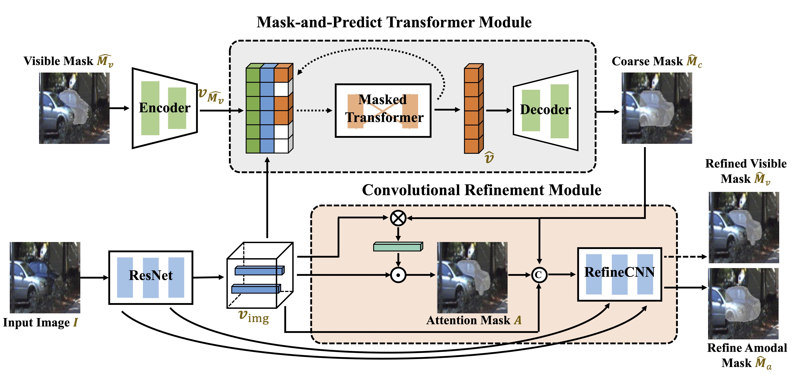
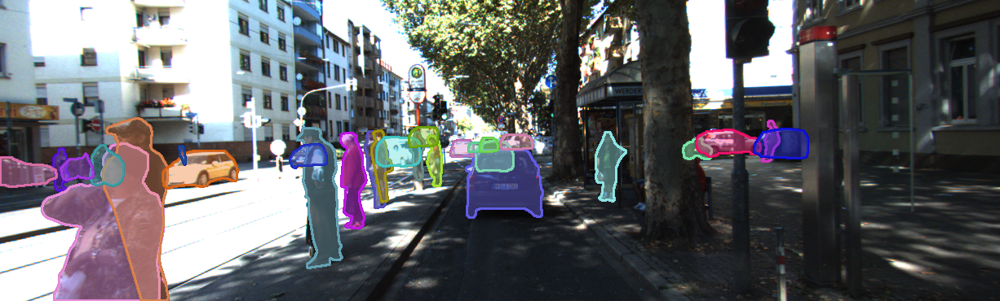
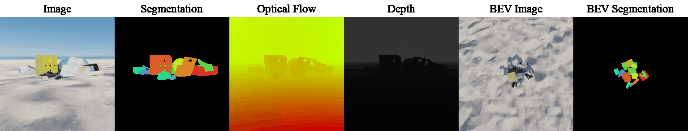

<center>

# [Coarse-to-Fine Amodal Segmentation with Shape Prior (C2F-Seg)](https://openaccess.thecvf.com/content/ICCV2023/papers/Gao_Coarse-to-Fine_Amodal_Segmentation_with_Shape_Prior_ICCV_2023_paper.pdf)

[Jianxiong Gao](https://jianxgao.github.io/), [Xuelin Qian†](https://naiq.github.io/), [Yikai Wang](https://yikai-wang.github.io/), [Tianjun Xiao†](https://tianjunxiao.com/), [Tong He](https://hetong007.github.io/), [Zheng Zhang](https://www.amazon.science/author/zheng-zhang), [Yanwei Fu](https://yanweifu.github.io/)


[](https://arxiv.org/abs/2308.16825)
[](https://jianxgao.github.io/C2F-Seg/)
[](https://data.dgl.ai/dataset/MOVi-Amodal/MOViD-Amodal.tar) 
[](https://github.com/amazon-science/c2f-seg/blob/main/LICENSE) 
[](https://hits.seeyoufarm.com)
</center>

# Introduction




# Environment Setup

```bash
git clone https://github.com/amazon-science/c2f-seg.git
cd c2f-seg
conda create --name C2F_Seg --file requirements.txt
```

# Data and checkpoints

| Dataset      |   $\text{mIoU}_{full}$ |    $\text{mIoU}_{occ}$      |  VQ Model        | C2F-Seg  |
| :---         |   :---:                |   :---:                     |    :---:   |   :---:          | 
| [KINS](https://data.dgl.ai/dataset/C2F-Seg/KINS.tar)         |     82.22             |   53.60        |  [weight](), [config]()              | [weight](), [config]()    |
| [COCOA](https://data.dgl.ai/dataset/C2F-Seg/COCOA.tar)        |     80.28              |    27.71       |  [weight](), [config]()            | [weight](), [config]()    |
| [MOViD-Amodal](https://data.dgl.ai/dataset/C2F-Seg/MOViD-Amodal.tar) |     71.67              |    36.13       |  [weight](), [config]()     | [weight](), [config]()    |

# KINS


### Train VQ model
```bash
CUDA_VISIBLE_DEVICES=0 python train_vq.py --dataset KINS --path KINS_vqgan --check_point_path ../check_points
```
### Train C2F-Seg
```bash
CUDA_VISIBLE_DEVICES=0,1,2,3,4,5,6,7 python -m torch.distributed.launch --nproc_per_node=8 \
train_c2f_seg.py --dataset KINS --batch 16 --data_type image --vq_path KINS_vqgan --path KINS_c2f_seg 
```

# MOViD-Amodal



### train vq model

```bash
CUDA_VISIBLE_DEVICES=0 python train_vq.py --dataset MOViD_A --path MOViD_A_vqgan --check_point_path ../check_points
```

### Train C2F-Seg
```bash
CUDA_VISIBLE_DEVICES=0,1,2,3,4,5,6,7 python -m torch.distributed.launch --nproc_per_node=8 \
train_c2f_seg.py --dataset MOViD_A --batch 1 --data_type video --vq_path MOViD_A_vqgan --path MOViD_A_c2f_seg 
```

# Citation
If you find our paper useful for your research and applications, please cite using this BibTeX:
```
@inproceedings{gao2023coarse,
  title={Coarse-to-Fine Amodal Segmentation with Shape Prior},
  author={Gao, Jianxiong and Qian, Xuelin and Wang, Yikai and Xiao, Tianjun and He, Tong and Zhang, Zheng and Fu, Yanwei},
  booktitle={Proceedings of the IEEE/CVF International Conference on Computer Vision},
  pages={1262--1271},
  year={2023}
}
```

## Security

See [CONTRIBUTING](CONTRIBUTING.md#security-issue-notifications) for more information.

## License

This project is licensed under the Apache-2.0 License.


